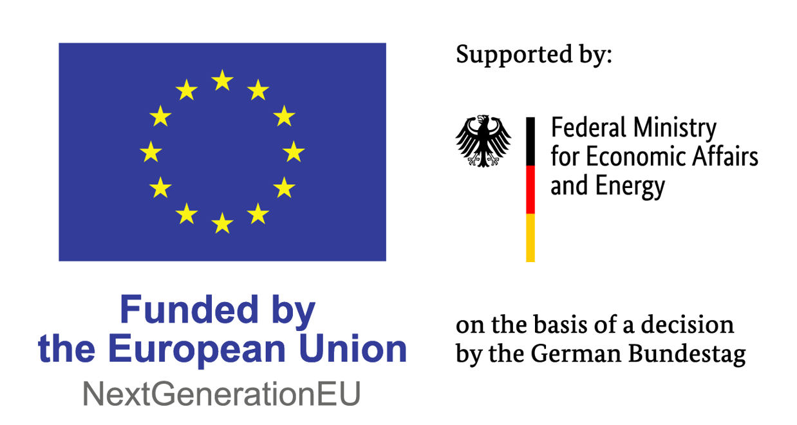

# Project Scope

This project provides software that enables independent operator platforms to participate in federation and exchange the information required to use capabilities and deploy applications across operator environments.

An **operator platform** provides a common platform through which an operator can expose and manage capabilities and services. In this project, the operator platforms participating in federation act as independent systems that can exchange information and coordinate operations with each other.

The project implements a subset of the **GSMA Operator Platform Group (OPG) East-Westbound Interface (EWBI)**. The EWBI defines APIs that an operator platform can expose and use to communicate with other operator platforms.

For more information, see the [GSMA East-Westbound Interface APIs](https://www.gsma.com/solutions-and-impact/technologies/networks/gsma_resources/east-westbound-interface-apis-version-6-0/).

## Federation

Federation allows two independent operator platforms to work together.

The operator requesting access to capabilities provided by another operator acts as the **Guest**, while the operator providing those capabilities acts as the **Host**.

The federation functionality supports operations including:

- Establishing a federation relationship
- Subscribing to Availability Zones provided by another operator
- Exchanging files and artefacts
- Onboarding applications
- Requesting application deployments
- Exchanging status and lifecycle information

The federation software coordinates these operations between the participating operators.

The Federation Manager is **not an end-to-end solution**. Users of this software are expected to integrate the federation software with their edge resource management systems or resource orchestrators, which are responsible for carrying out platform-specific workload operations.

## Project Status

> **⚠️ Under development**
>
> IMPORTANT: This solution is a work in progress.
>

## Contributing

Please read [CONTRIBUTING.md](CONTRIBUTING.md) before opening a pull request.

All pull requests must follow the project's contribution requirements, including conventional commits and the PR template.

## Funding and Support

This open source project is part of activities carried out within the Important Project of Common European Interest on Next Generation Cloud Infrastructure and Services (IPCEI-CIS), an EU initiative to build a sovereign, interoperable and energy-efficient cloud-to-edge infrastructure in Europe.

  

## Documentation

The documentation describes how the federation system works internally, from the concepts and architecture through to the implementation and deployment of the Federation Manager.

### Start Here

**[Quick Start Guide](docs/Quick-start-introduction.md)**

Provides a quick introduction to the project, its main concepts and the knowledge needed to understand the federation platform.

### Federation Architecture & Mechanism

**[High-Level Architecture](docs/architecture.md)**

Describes the overall architecture of the federation platform and the relationships between its major components.

**[Core Components](docs/components.md)**

Describes the main implementation components, including:

- Host and Guest environments
- Federation Manager
- EWBI Operator
- EWBI API
- Federation Custom Resources
- Local orchestration

**[Federation Model and Workflows](docs/federation.md)**

Describes how federation operations work, including:

- Federation establishment
- Availability Zone subscription
- Resource flow
- Application onboarding
- Application deployment
- Reconciliation and state synchronisation
- Callbacks and status updates
- Failure handling

**[Security](docs/security.md)**

Describes the security mechanisms and trust relationships used by the federation implementation.

### Deployment

**[Deployment Guide](docs/deployment.md)**

Provides the prerequisites and instructions required to build and deploy the Federation Manager.
For local end-to-end testing using Kind, see the testing documentation in the `docs/` directory.

## Contact details

**To be completed:** Contact details and information on how to join the project.

## Partners involved

**To be completed:** Full list of partners involved in the project and link to the relevant source.