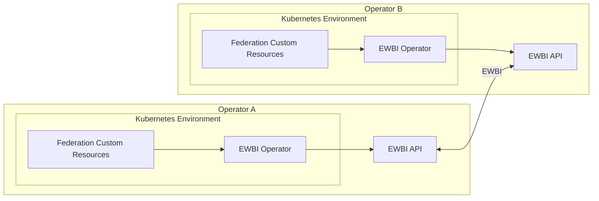
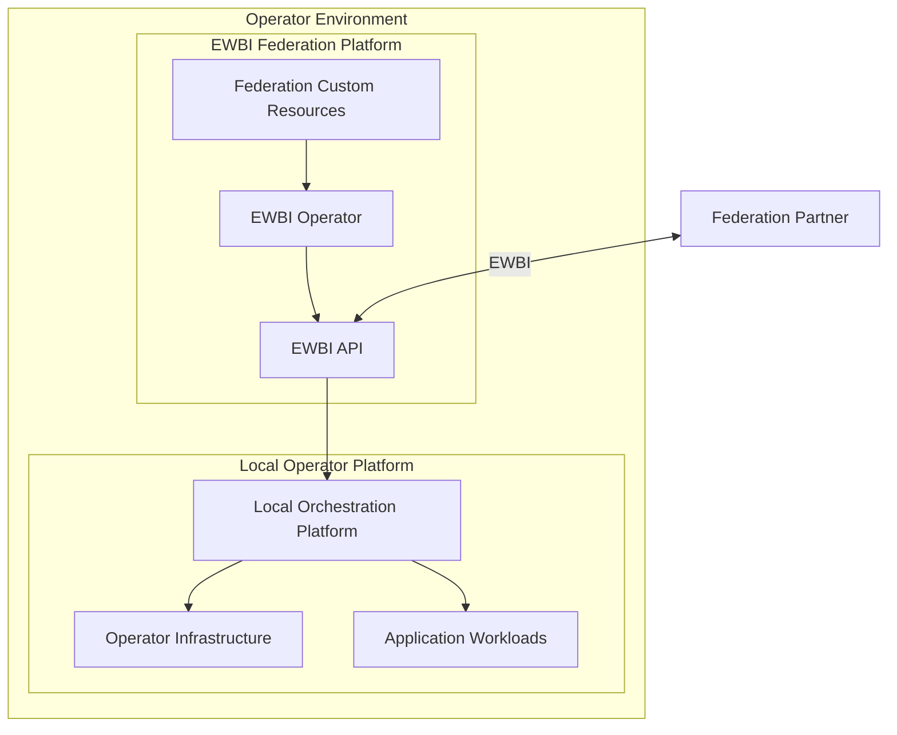
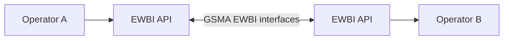
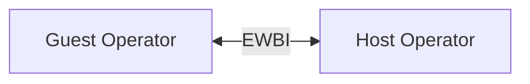

# EWBI Federation Platform Architecture

## Purpose

This document describes the high-level architecture of the EWBI Federation Platform.

It focuses on the major building blocks of the platform, the boundaries between them, and how independent operator environments communicate.

Detailed implementation information is provided in [Core Components](components.md), while federation workflows and runtime behaviour are described in [Federation Model and Workflows](federation.md).

---

## System Context

The EWBI Federation Platform extends an existing operator platform with capabilities for interoperability and federation.

Each participating operator maintains its own Kubernetes environment, federation components, infrastructure and operational policies. The federation layer provides a standardised interface through which these independent platforms can exchange federation information and coordinate operations.

At a high level, an operator environment contains:

* Kubernetes resources used to represent federation state
* An EWBI Operator responsible for the Kubernetes-facing federation layer
* An EWBI API providing the operator-to-operator federation interface
* A local orchestration platform responsible for workload execution

The federation platform therefore complements the operator's existing platform rather than replacing it.

The cross-operator boundary is provided by the EWBI interface. Internal platform and infrastructure implementations remain under the control of each individual operator.

---

## Architectural Principles

### Standards-Based Federation

Operators communicate using the GSMA-defined EWBI interfaces.

This provides a common interoperability boundary between independent operator platforms without requiring them to use the same underlying infrastructure or internal implementation.

### Administrative Independence

Each operator remains responsible for its own platform and infrastructure.

Federation allows capabilities to be shared between operators without requiring a central operational platform or exposing the internal implementation of either operator.

### Kubernetes-Native Management

Federation resources are represented within Kubernetes.

This provides a local management boundary for federation resources while the EWBI APIs provide the interoperability boundary between operators.

### Distributed Federation

The platform follows a distributed, peer-to-peer model.

There is no central federation broker or controller through which all operators must communicate. Operators communicate directly with their federation partners.

### Separation of Federation and Workload Execution

The federation layer coordinates federation operations and exchanges the information required to request workloads.

Actual workload execution remains under the control of the local operator platform.

This separation allows different operators to use different orchestration technologies while participating in the same federation.

---

## High-Level Architecture

Each participating operator maintains its own independent environment.

The diagram shows the principal architectural boundary between two independent operator environments.

Within each operator, Kubernetes resources are managed by the EWBI Operator. The EWBI API provides the external interface through which the two operators communicate.

The diagram deliberately does not show the internal implementation of the Operator or API. Those details are described in [Core Components](components.md).

---

## Federation Platform Boundary

The federation components sit alongside the operator's existing platform rather than replacing it.

The federation platform provides the federation interface and coordination layer.

The local operator platform remains responsible for infrastructure and workload execution.

The connection between the federation layer and the local orchestration platform is an architectural boundary rather than a specification of a particular implementation. The exact mechanism used to consume federation resources and execute workloads may differ between operators.

---

## Component Relationships

The architecture is based on several distinct responsibilities.

### Kubernetes

Kubernetes provides the local environment in which federation resources are represented and managed.

### EWBI Operator

The EWBI Operator connects Kubernetes-managed federation resources with federation operations.

It operates within the local Kubernetes environment and interacts with the local EWBI API.

The internal controller structure and implementation are described in [Core Components](components.md).

### EWBI API

The EWBI API provides the external federation interface.

It receives and exposes the operations required for communication between federation partners using the EWBI protocol.

The API also provides the boundary between external federation requests and the local platform representation of those requests.

### Federation Custom Resources

Federation Custom Resources provide the Kubernetes representation of federation objects.

They allow federation state and requests to be represented within the operator's local Kubernetes environment.

The individual resource types and their implementation are described in [Core Components](components.md).

### Local Orchestration Platform

The local orchestration platform remains responsible for executing workloads within the operator's infrastructure.

The federation architecture does not require a particular orchestration technology.

The exact relationship between federation resources and the local orchestration system is therefore operator-specific.

---

## Operator-to-Operator Interface

The EWBI API provides the communication boundary between independent operators.

The EWBI interface allows each operator to retain its own internal architecture while exposing a common federation interface to its partners.

No central federation service is required for operators to communicate.

---

## Architectural Boundaries

The following boundaries are important to the design.

### Federation Platform Responsibilities

The federation platform provides:

* Federation management
* Federation resource representation
* Cross-operator EWBI communication
* Coordination of federation operations
* Federation-related state management

### Local Operator Platform Responsibilities

The following remain under the control of the individual operator:

* Kubernetes cluster administration
* Infrastructure provisioning
* Infrastructure capacity management
* Infrastructure-level networking
* Workload scheduling
* Application runtime execution
* Operator-specific orchestration

The federation platform therefore does not prescribe how an operator manages or executes workloads internally.

---

## Guest and Host Roles

An operator may participate as a Guest or Host within a federation relationship.

These are logical roles rather than separate architectural deployments.

Both operators can use the same high-level federation architecture:

The role determines how an operator participates in a particular federation relationship rather than requiring a different set of federation components.

The detailed differences in Guest and Host behaviour are described in [Federation Model and Workflows](federation.md).

---

## Related Documentation

* [Quick Start Guide](Quick-start-introduction.md) — Introduction to the platform and its key concepts.
* [Architecture](architecture.md) — Describes the high-level architecture of the EWBI Federation Platform
* [Core Components](components.md) — Detailed responsibilities and implementation of the platform components.
* [Federation Model and Workflows](federation.md) — Detailed federation behaviour and resource workflows.
* [Security](security.md) — Security model and trust boundaries.

