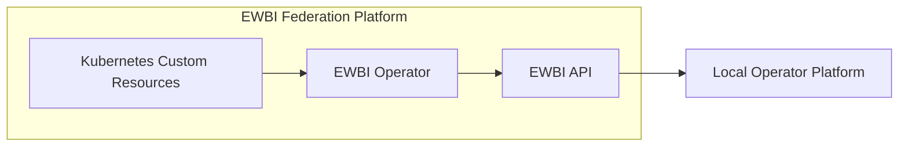
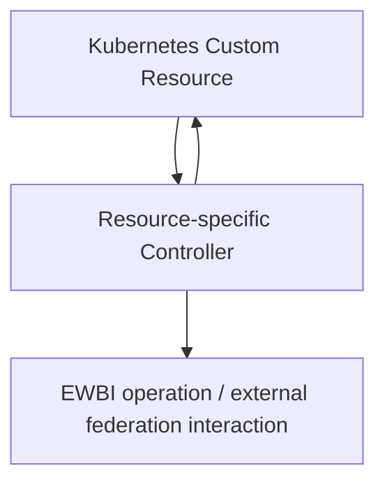
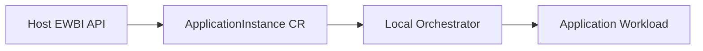
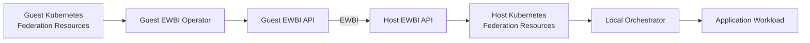

# Core Components

This document describes the main implementation components of the EWBI Federation Platform and the responsibility of each component.

The platform combines a Kubernetes-native federation management layer with the EWBI REST interface used for communication between operators. Federation resources are represented as Kubernetes Custom Resources, while workload execution remains the responsibility of the local operator platform.

---

## Component Overview

The core federation implementation consists of the following components:



The **EWBI Operator** and **EWBI API** form the main federation software.

Kubernetes provides the environment in which federation resources are managed. The local operator platform is responsible for using the resulting information to perform operator-specific actions, including workload execution.

---

# Host and Guest Clusters

The federation components operate within the Kubernetes environment of each participating operator.

The same core components can be present on both sides of a federation relationship. The Guest or Host role is determined by the federation relationship associated with the resources being processed.

## Guest Cluster

On the Guest side, federation resources are represented as Kubernetes Custom Resources.

The EWBI Operator monitors these resources and, where required, performs federation operations against the partner operator through the EWBI API.

For example, the `FederationReconciler` identifies a Guest federation resource and can use it to initiate federation establishment with the partner and process the Availability Zones offered by that partner.

The Guest Kubernetes environment therefore provides the local representation of federation resources and their state.

## Host Cluster

On the Host side, requests received from a federation partner through the EWBI API are represented as Kubernetes Custom Resources.

The API uses a Kubernetes-backed metastore to create and manage these resources.

For example:

* Application onboarding creates an `Application` resource.
* Application installation creates an `ApplicationInstance` resource.
* File upload creates a `File` resource.
* Artefact upload creates an `Artefact` resource.

## The API therefore provides the transition between the external EWBI interface and the Host's local Kubernetes environment.

# Federation Manager

The Federation Manager is the core federation software deployed within an operator environment.

It consists of:

* **EWBI Operator**
* **EWBI API**

The two components have complementary responsibilities:

* The **EWBI Operator** manages and processes federation resources within Kubernetes.
* The **EWBI API** provides the external federation interface between operators.

---

## EWBI Operator

The EWBI Operator is implemented using Kubernetes controllers.

The implementation contains a separate reconciler for each main federation resource type:

```text
EWBI Operator
├── FederationReconciler
├── AvailabilityZoneReconciler
├── FileReconciler
├── ArtefactReconciler
├── ApplicationReconciler
└── ApplicationInstanceReconciler
```

Each controller is registered against its corresponding Custom Resource using the Kubernetes controller-runtime framework. For example, the Federation controller watches `Federation` resources and the ApplicationInstance controller watches `ApplicationInstance` resources.

### Resource-specific controllers

The controllers share a common pattern but implement resource-specific behaviour.

A controller typically:

1. Retrieves its Kubernetes resource.
2. Identifies the associated federation.
3. Determines whether it is handling a Guest or Host resource.
4. Performs the appropriate operation.
5. Updates the Kubernetes resource status.

The exact operation depends on the resource type and federation role.

### FederationReconciler

The `FederationReconciler` manages `Federation` resources.

For Guest resources, it can construct and submit a federation request to the partner API and process the Availability Zones returned by the partner.

It can subsequently submit the selected Availability Zone to the partner through the federation interface.

For Host resources, the controller maintains the Host-side federation resource and its state.

### AvailabilityZoneReconciler

The `AvailabilityZoneReconciler` manages `AvailabilityZone` resources.

The current implementation retrieves the resource and updates its state to `READY`. The source does not currently show a more extensive Availability Zone reconciliation process.

### FileReconciler

The `FileReconciler` manages `File` resources.

The controller associates the File with its parent federation using the federation context identifier.

On the Guest side, it converts the Kubernetes resource into the corresponding EWBI file-upload request and sends it to the partner API.

On the Host side, it maintains the Host-side resource and handles status propagation.

### ArtefactReconciler

The `ArtefactReconciler` manages `Artefact` resources.

The Guest-side controller converts the Kubernetes resource into the corresponding EWBI artefact request.

The request can contain component information including images, number of instances, restart policy, exposed interfaces and compute-resource requirements.

### ApplicationReconciler

The `ApplicationReconciler` manages `Application` resources.

On the Guest side, it translates the Kubernetes resource into an application onboarding request containing application metadata, component references, QoS information and callback information before sending it to the partner API.

The resulting state is reflected in the Kubernetes resource status.

### ApplicationInstanceReconciler

The `ApplicationInstanceReconciler` manages `ApplicationInstance` resources.

On the Guest side, it converts the resource into an application installation request containing information such as:

* Application ID
* Application version
* Application instance ID
* Target Availability Zone
* Resource information
* Callback information

and sends the request to the partner API.

On the Host side, the controller maintains the application-instance resource and processes status information that can be returned through the federation callback mechanism.

### Guest and Host identification

The implementation uses Kubernetes labels to associate resources with a federation context and identify their federation relationship.

Important labels include:

```text
opg.ewbi.nby.one/federation-context-id
opg.ewbi.nby.one/federation-relation
opg.ewbi.nby.one/id
```

The federation relation is represented as either:

```text
guest
host
```

These labels allow controllers to locate the appropriate federation and determine which side of the relationship they are processing.

### Status and finalizers

The controllers use Kubernetes status fields to represent the state of federation resources.

The implementation also uses Kubernetes finalizers when an external federation resource must be handled before the Kubernetes resource is fully removed.

For example, the File, Artefact, Application and ApplicationInstance controllers add finalizers and perform the corresponding external deletion operation before removing the finalizer.

## EWBI API

The EWBI API provides the HTTP interface used for communication with federation partners.

The API is implemented as an HTTP server with access to:

* A Kubernetes client
* A Kubernetes-backed metastore
* A deployment client

This allows the API to translate between incoming EWBI operations and the local Kubernetes representation of federation resources.

### HTTP handlers

The API contains handlers for federation operations such as:

* Federation management
* Availability Zone operations
* Application onboarding
* Artefact management
* File management
* Application instance installation and removal
* Resource information retrieval

Handlers validate and bind incoming requests before passing them to the appropriate internal component.

### Kubernetes-backed metastore

The metastore provides the translation between EWBI data models and Kubernetes Custom Resources.

It is responsible for creating, retrieving and updating the Kubernetes representation of federation resources.

For example, an incoming application onboarding request is converted into an `Application` resource and associated with the relevant federation context.

The same pattern is used for files, artefacts and application instances.

### Deployment layer

The API contains a deployment abstraction for application-instance operations.

The `Install` operation creates an `ApplicationInstance` Custom Resource through the metastore rather than directly deploying a workload.

This keeps the federation API independent of the specific mechanism used by an operator to execute workloads.

### Callback handlers

The API provides callback endpoints for receiving asynchronous status information.

For example, application and application-instance callbacks update the corresponding Kubernetes resource through the metastore.

The callback mechanism therefore allows externally generated federation status to be reflected in the local Kubernetes resources.

### Authentication and client identification

The supplied implementation uses the `X-Client-ID` HTTP header to identify the calling client.

The client ID is extracted from the request and is used when generating the federation context identifier.

The current `ValidateAuthHeaders` implementation does not perform substantive authentication validation and returns `202 Accepted`.

The broader security model and required trust mechanisms are documented separately in [Security](security.md).

---

# Kubernetes Custom Resources

The federation Custom Resource definitions are located under:

```text
api/v1beta1/
```

The current resource types are:

| Resource             | Kubernetes type       |
| -------------------- | --------------------- |
| Federation           | `Federation`          |
| Availability Zone    | `AvailabilityZone`    |
| File                 | `File`                |
| Artefact             | `Artefact`            |
| Application          | `Application`         |
| Application Instance | `ApplicationInstance` |

Each resource follows the Kubernetes `spec` / `status` model.

The `spec` contains the resource information used by the federation implementation, while `status` represents the observed state.

For example, `Application` contains application metadata, component references, QoS information and callback information, while its status represents the application's state.

`ApplicationInstance` contains application, version and zone information in its specification, while its status contains state, conditions, access-point information and the application-instance identifier.

## Federation Context and Labels

Federation resources are associated with a Federation Context using Kubernetes labels.

The implementation defines labels for:

* Federation Context ID
* External resource ID
* Federation relationship

The federation relationship identifies resources as either Guest or Host resources.

These labels are used by the controllers and metastore when locating resources associated with a particular federation.

## Host-side Resource Creation

One of the key implementation boundaries is the conversion of incoming EWBI requests into Host-side Kubernetes resources.

For example, an incoming application installation request is converted into an `ApplicationInstance` resource containing:

* Application provider
* Application ID
* Application version
* Target zone
* Resource information
* Callback information

The generated resource is labelled with the federation context and Host relationship.

The resulting Kubernetes resource can then be consumed by other components of the Host platform.

## Relationship with the Operator

Custom Resources provide the Kubernetes-side interface consumed by the resource-specific controllers.



The exact direction of the external operation depends on the resource and whether it is being processed on the Guest or Host side.

---

# Local Orchestrator

The Local Orchestrator is the operator-specific component responsible for translating federation deployment information into actions within the operator's infrastructure.

It is **not part of the EWBI protocol implementation**.

The federation platform provides the resource representation and federation coordination, while the local operator determines how workloads are ultimately deployed and managed.

## Interface with the Federation Platform

For application installation, the Host EWBI API creates an `ApplicationInstance` Custom Resource rather than directly executing the workload.

The resource contains information such as:

* Application identifier
* Application version
* Target Availability Zone
* Resource pool
* Resource requirements
* Callback information

The resulting architectural boundary is:



The federation implementation confirms the first step, from the API to the Kubernetes resource. The subsequent interaction between the Custom Resource and the local orchestrator is **operator-specific** and is not defined by the EWBI implementation.

## NearbyOne

An operator may use **NearbyOne**, an end-to-end, cross-domain edge orchestration platform developed by Nearby Computing, as its local orchestration platform.

In such an environment, the federation resources can provide the information required for the local platform to manage the infrastructure, connectivity and application deployment associated with a federated workload.

NearbyOne is therefore an example of an **operator platform integrated with the federation layer**, rather than a component required by EWBI.

# Component Interaction

The following diagram summarises the main implementation boundary without describing the complete federation workflow:



The diagram represents the principal implementation boundary:

**Guest Kubernetes resources → Guest federation components → EWBI → Host federation components → Host Kubernetes resources → local orchestration.**

The detailed sequence of operations, state transitions and callbacks is documented in [Federation Model and Workflows](federation.md).

## Related Documentation

* [Quick Start Guide](Quick-start-introduction.md) — Introduction to the platform and its key concepts.
* [Core Components](components.md) — Detailed responsibilities and implementation of the platform components.
* [Federation Model and Workflows](federation.md) — Detailed federation behaviour and resource workflows.
* [Security](security.md) — Security model and trust boundaries.
* [Diagrams](diagrams.md) — Collection of the platform's Mermaid diagrams.
* [Deployment Guide](deployment.md) — Installation and configuration.
* [Connectivity Guide](connectivity.md) — Connectivity requirements between operators.
* [Troubleshooting Guide](troubleshooting.md) — Verification and troubleshooting.
