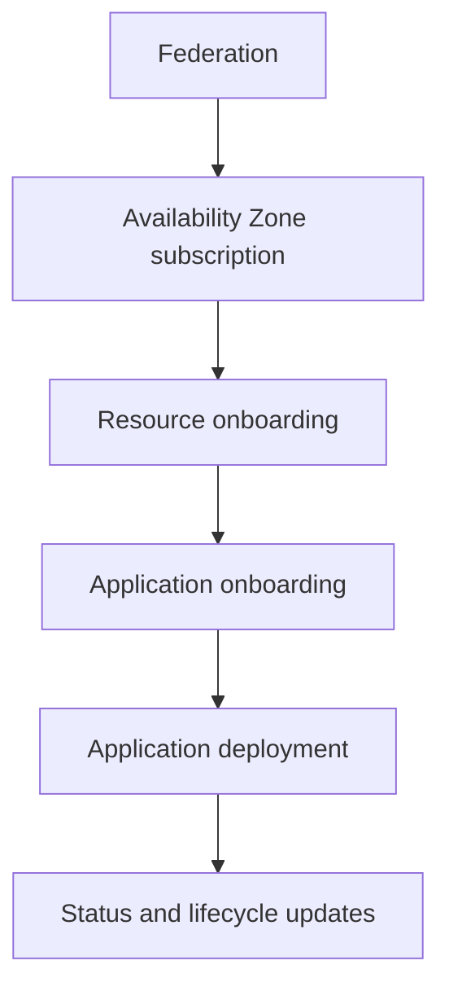
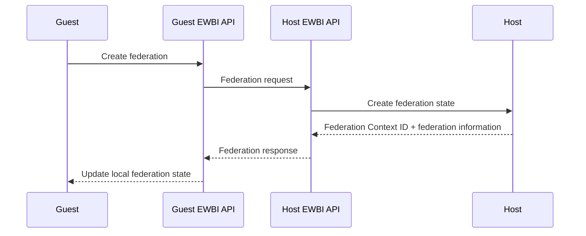
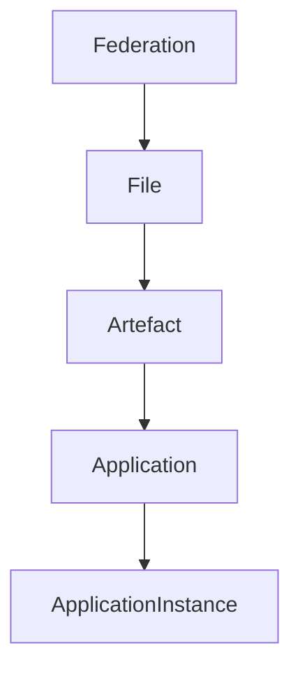
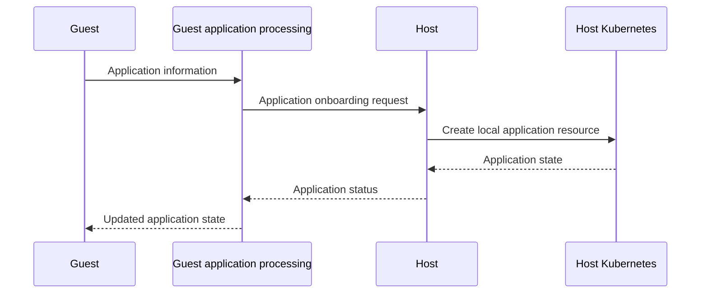
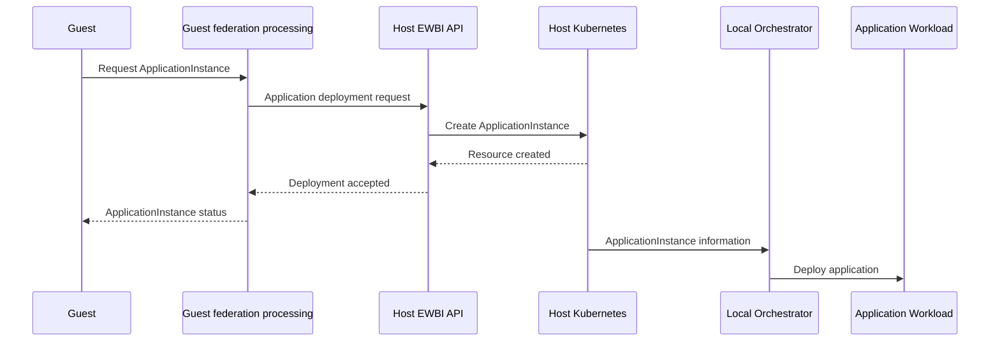
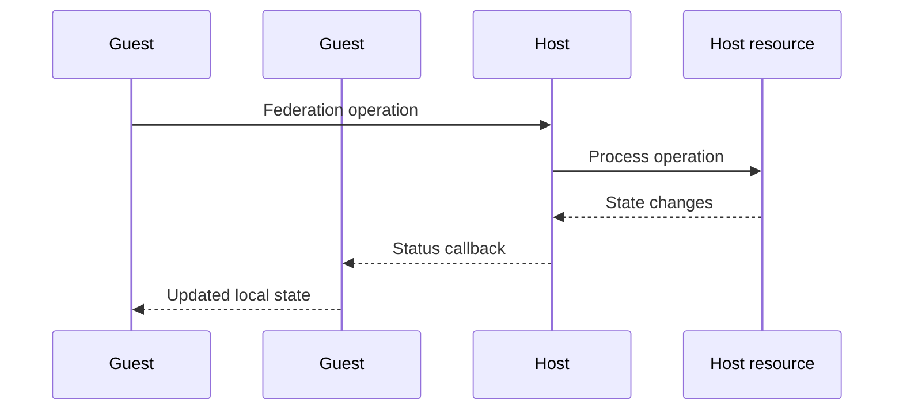
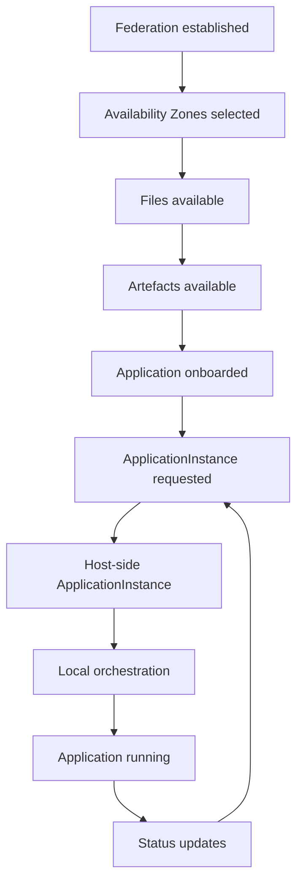

# Federation Model and Workflows

This document describes how federation operations are performed between participating operators.

It focuses on the lifecycle of a federation relationship, how federation resources move between operators, how application deployments are requested and executed, and how status information is propagated.

For the architecture and implementation of the individual components, see [Architecture](architecture.md) and [Core Components](components.md).

---

# Federation Model

A federation relationship connects two independent operator platforms.

The operator requesting access to a partner's capabilities acts as the **Guest**, while the operator providing those capabilities acts as the **Host**.

The relationship is associated with a unique **Federation Context ID**. This identifier is used to associate subsequent federation operations with the correct relationship.

A federation can be viewed as a progression from establishing the relationship through to deploying and managing applications:



---

# Federation Registration

Federation registration establishes the relationship between the Guest and Host.

The Guest initiates the process by creating a federation request. The request contains the information required to identify the originating operator and establish communication with the partner.

The Host receives the request, creates the corresponding federation state and provides the information required for the Guest to continue the federation process.

The Guest then stores the resulting federation information locally.

At a high level:

1. The Guest initiates federation.
2. The request is sent to the Host.
3. The Host creates the federation relationship.
4. The Host returns the Federation Context ID and available federation information.
5. The Guest records the resulting federation state.

### Federation registration sequence



The Federation Context ID is then used by subsequent federation operations to identify the relationship.

---

# Availability Zone Subscription

After federation has been established, the Host can make Availability Zones available to the Guest.

The Guest receives information about the zones offered by the Host and can select the zones it wishes to use.

The Host then records the zones accepted by the Guest.

The basic relationship is:

```text
Host
  │
  ├── Offers Availability Zones
  │
  ▼
Guest
  │
  ├── Selects Availability Zones
  │
  ▼
Host
  │
  └── Records accepted zones
```

The Availability Zone information becomes part of the context used for subsequent application operations.

---

# Resource Flow

Federation resources build on one another.

The main resource relationship is:



Each stage provides information required by the following stage.

## Federation

The Federation establishes the relationship and provides the Federation Context in which subsequent resources are exchanged.

## File

A File represents deployable application content, such as an application image.

The Guest makes the file available to the Host as part of the application onboarding process.

## Artefact

An Artefact describes information needed to deploy an application workload.

It can describe workload components, images, resource requirements, interfaces and other deployment information.

## Application

An Application represents the application being onboarded into the federation.

It references the artefacts required to deploy its components and contains application metadata and requirements.

## ApplicationInstance

An ApplicationInstance represents an instance of an application that is requested for deployment in a particular Availability Zone.

It connects the application with a specific deployment location and the information required to execute that deployment.

---

# Application Onboarding

Application onboarding makes an application available within the federation so that it can subsequently be deployed.

The Guest provides the Host with the application information and the artefacts required to support the application.

The Host creates the corresponding local application representation and processes the onboarding request.

The basic flow is:

1. Application resources are prepared by the Guest.
2. The Guest sends the application information to the Host.
3. The Host records the application in its local platform.
4. The Host processes the application onboarding operation.
5. The resulting application state is communicated back to the Guest.

### Application onboarding sequence



An application can then be used to create one or more application instances.

---

# Application Deployment

Application deployment begins when the Guest requests an `ApplicationInstance` for an onboarded application.

The Guest identifies the application and the Availability Zone in which the instance should be deployed.

The request is sent to the Host through the federation interface.

On the Host, the deployment request is represented as a Kubernetes `ApplicationInstance` resource.

This resource contains the information required to describe the requested deployment, including the application, version, target Availability Zone and resource requirements.

The Host's local orchestration platform can then use this resource to perform the actual workload deployment.

The separation is important:

```text
Federation
     │
     ▼
ApplicationInstance
     │
     ▼
Host Kubernetes
     │
     ▼
Local orchestration
     │
     ▼
Application workload
```

The federation layer coordinates the request, while the Host remains responsible for executing the workload using its own platform.

### Application deployment sequence



The exact interaction between the Host Kubernetes environment and the local orchestration platform depends on the operator's implementation.

---

# Reconciliation and State Synchronisation

Federation resources have both a requested state and an observed state.

The requested information describes what the operator wants to happen.

The observed state records the current state of the federation operation.

This allows federation operations to progress asynchronously rather than requiring the original request to remain open until the operation has completely finished.

For example, an application may initially be:

```text
PENDING
   ↓
ONBOARDED
```

while an application instance can move through states such as:

```text
PENDING
   ↓
READY
```

or:

```text
PENDING
   ↓
FAILED
```

An application instance may also enter:

```text
READY
   ↓
TERMINATING
```

when it is being removed.

The Guest and Host each maintain their own local representation of the relevant federation resources. Status information is propagated between the operators so that the Guest can observe changes occurring on the Host.

---

# Event and Callback Model

Many federation operations are asynchronous.

Instead of requiring the Guest to repeatedly query the Host for changes, the Host can send status information to a callback endpoint associated with the federation.

The general pattern is:



Callbacks can communicate changes associated with resources such as:

* Applications
* Application Instances
* Files
* Artefacts
* Federation status

The callback information allows the receiving operator to update its local representation of the resource.

For example, when an Application Instance changes state, the Host can send the current state and access-point information to the Guest. The Guest can then update its local ApplicationInstance resource.

---

# Communication Model

Federation uses different communication mechanisms for different purposes.

## Kubernetes API

The Kubernetes API is used within an operator environment.

It is used to create, retrieve and update federation Custom Resources and their status.

## EWBI REST API

The EWBI REST API is used for communication between the Guest and Host.

Federation requests such as registration, resource onboarding and application deployment are exchanged through the EWBI interface.

## Callbacks

Callbacks are used to communicate asynchronous status information from one operator to another.

This allows a federation operation to continue independently while the participating operators exchange status updates.

A simplified communication model is:

```text
Guest Kubernetes
      │
      ▼
Guest federation processing
      │
      ▼
   EWBI REST
      │
      ▼
Host federation processing
      │
      ▼
Host Kubernetes
      │
      ▼
Local platform

          ▲
          │
       Callback
          │
          └────────────── Guest
```

For details of how these interfaces are implemented, see [Core Components](components.md).

---

# Failure and Recovery

Federation operations can fail at different points in their lifecycle.

Examples include:

* Invalid federation or application information
* A requested resource not being available
* A communication failure between operators
* A problem processing a workload
* An application or application instance being unable to reach its requested state

When an operation fails, the corresponding federation resource records an error or failed state.

For example, applications can enter `FAILED`, while application instances can enter `FAILED` or `TERMINATING` depending on the operation being performed.

Intermediate states such as `PENDING` allow an operation to remain active while processing is still in progress.

The resource state therefore provides the primary indication of whether an operation is progressing, has completed successfully, or has encountered a problem.

For operational diagnosis and debugging procedures, see [Troubleshooting](troubleshooting.md).

---

# Federation Lifecycle Summary

The complete lifecycle can be summarised as:



This lifecycle describes the relationship between the major federation resources and the progression from federation establishment to application execution.

The federation layer coordinates the relationship and exchanges information between operators, while each operator retains responsibility for its own local platform and workload execution.

## Related Documentation

* [Quick Start Guide](Quick-start-introduction.md) — Introduction to the platform and its key concepts.
* [Core Components](components.md) — Detailed responsibilities and implementation of the platform components.
* [Federation Model and Workflows](federation.md) — Detailed federation behaviour and resource workflows.
* [Security](security.md) — Security model and trust boundaries.
* [Diagrams](diagrams.md) — Collection of the platform's Mermaid diagrams.
* [Deployment Guide](deployment.md) — Installation and configuration.
* [Connectivity Guide](connectivity.md) — Connectivity requirements between operators.
* [Troubleshooting Guide](troubleshooting.md) — Verification and troubleshooting.
