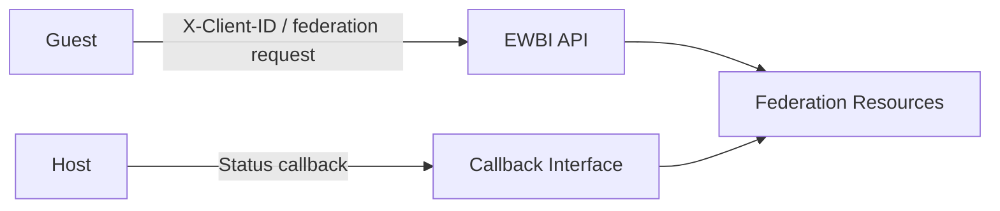

# Security

This document describes the security mechanisms currently implemented by the EWBI Federation Platform.

Security-related behaviour is present at several points in the federation platform, including operator communication, API requests, callbacks and access to Kubernetes resources.

---

## Security Model

Federation communication is associated with a specific federation relationship.

The `Federation` resource stores partner communication information, including:

* Partner callback credentials
* Partner status link
* Guest partner credentials

The credential information includes a client ID and token URL.

The Federation Context ID is used to associate federation resources and operations with the corresponding federation relationship.

---

## Operator-to-Operator Trust

The current implementation uses federation-specific partner information when communicating with another operator.

For example, when establishing a federation, the Guest-side Federation controller uses the partner token URL and client ID configured in the federation resource when creating the client used to send the federation request.

The same partner information is used by Guest-side controllers when performing operations such as application onboarding.

The current implementation does not define a separate operator-registration mechanism.

---

## API Authentication

The API identifies the calling client using the `X-Client-ID` HTTP header.

The client ID is extracted from the incoming request and used when processing the request.

The client ID is also used when generating the Federation Context ID.

The current `ValidateAuthHeaders` handler returns `202 Accepted` without performing additional authentication validation.

As a result, the current implementation provides client identification through `X-Client-ID`, but does not perform additional authentication validation in this handler.

---

## Callback Security

Callbacks use information stored in the federation resource.

The `Federation` resource contains:

* `Partner.CallbackCredentials.ClientId`
* `Partner.CallbackCredentials.TokenUrl`
* `Partner.StatusLink`

When sending an application callback, the implementation uses the configured partner status link and callback client ID.

The same mechanism is used for File, Artefact and ApplicationInstance callbacks.
The Guest API provides callback endpoints that process the received notifications and update the corresponding local resource.

The current implementation does not define additional callback authentication or authorisation checks.

---

## Kubernetes Security

The federation controllers use Kubernetes RBAC declarations for the resources they manage.

For example, the Federation controller declares permissions for:

* `federations`
* `federations/status`
* `federations/finalizers`

The ApplicationInstance controller declares corresponding permissions for:

* `applicationinstances`
* `applicationinstances/status`
* `applicationinstances/finalizers`

The controllers use the Kubernetes client to retrieve resources and update their status.

Federation resources also use Kubernetes labels to associate resources with a Federation Context and identify whether a resource belongs to the Guest or Host side.

The current implementation defines labels for:

```text
opg.ewbi.nby.one/federation-context-id
opg.ewbi.nby.one/federation-relation
opg.ewbi.nby.one/id
```

The federation relationship is represented as `guest` or `host`.

These labels are used when locating the Federation associated with a resource.

---

## Application and Workload Trust

The federation resources contain application and deployment information.

An `Artefact` can contain:

* Images
* Number of instances
* Restart policy
* Compute resource requirements
* Exposed interfaces

An `ApplicationInstance` contains information including:

* Application ID
* Application version
* Zone information
* Resource consumption
* Resource pool
* Callback link

The current implementation uses this information as part of application onboarding and deployment.

The current implementation does not define a separate mechanism for verifying the trustworthiness of application images or artefacts.

The current implementation also does not define the security mechanisms used to isolate the resulting workload after deployment.

---

## Security Boundaries

The security-related boundaries in the current implementation can be represented as:



Federation-specific client and callback information is associated with the Federation resource and used during communication between operators.

---

## Security Gaps

The following areas are not defined by the current implementation.

### Authentication Validation

The API reads `X-Client-ID`, but the current `ValidateAuthHeaders` handler does not perform additional authentication validation.

### Transport Security

The current implementation does not define how transport security is configured for communication between operators.

### Credential Protection

The Federation resource contains client IDs and token URLs, but the current implementation does not define how these values are protected within the Kubernetes environment.

### Callback Authentication

The current implementation uses configured callback information when sending notifications, but does not define additional callback authentication or authorisation checks.

### Application and Artefact Verification

The current implementation represents application images and artefacts but does not define a separate mechanism for verifying their authenticity or integrity.

### Workload Security

The current implementation does not define the security controls used by the local platform to isolate or protect deployed workloads.

---

## Summary

The current implementation associates operator communication with federation-specific client and callback information, identifies API clients using `X-Client-ID`, and uses Kubernetes RBAC for access to federation resources.
The implementation does not currently define additional mechanisms for authentication validation, transport security, credential protection, callback authentication, application and artefact verification, or workload isolation.
